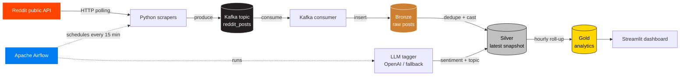

# Reddit Trends — Real-Time Data Engineering Pipeline

End-to-end pipeline that scrapes top posts from a configurable list of subreddits, streams them through Apache Kafka, lands them in a DuckDB warehouse organised in three layers (Bronze / Silver / Gold), tags each post with an LLM-driven sentiment + topic classifier, and surfaces hourly analytics through a Streamlit dashboard.

Built as a portfolio project to showcase the stack a junior data engineer is expected to operate in 2026: cloud-friendly file formats, real-time streaming, dimensional modelling, and AI-augmented enrichment.


---

## Architecture



---

## What this project demonstrates

- **Real-time ingestion** with Apache Kafka (producer + consumer + idempotent delivery)
- **Medallion-style layering** in DuckDB (Bronze raw → Silver clean → Gold aggregated)
- **Workflow orchestration** with Apache Airflow (TaskFlow API, every 15 minutes, retries)
- **LLM-augmented enrichment** with a graceful rule-based fallback (no OpenAI key required to run)
- **Analytics surface** through a Streamlit dashboard that reads directly from the Gold layer
- **Reproducible local environment** via `docker compose up` — Kafka, Zookeeper, Airflow, the consumer, and the dashboard all spin up together

---

## Repository layout

```
.
├── docker-compose.yml          # full stack: Kafka, Airflow, consumer, dashboard
├── requirements.txt
├── .env.example
├── scrapers/
│   ├── reddit_scraper.py       # polls the Reddit public API
│   ├── kafka_producer.py       # publishes posts to Kafka
│   ├── kafka_consumer.py       # drains Kafka into Bronze
│   └── llm_tagger.py           # OpenAI tagging + rule-based fallback
├── dags/
│   └── reddit_pipeline_dag.py  # Airflow DAG, every 15 minutes
├── sql/
│   ├── ddl.sql                 # Bronze / Silver / Gold table definitions
│   └── transformations.sql     # Bronze → Silver → Gold logic
├── dashboard/
│   └── app.py                  # Streamlit dashboard
└── docs/
    └── architecture.png        # exported diagram
```

---

## Pipeline stages in detail

### 1. Bronze — raw ingestion
- The Reddit public API is polled every 15 minutes.
- Each post is normalised into a typed `RedditPost` dataclass and serialised to JSON.
- The consumer writes one row per `(post_id, fetched_at)` pair so we can track score / comment growth over time without losing history.

### 2. Silver — clean & enrich
- A single row per `post_id` is kept (the most recent snapshot).
- LLM tagger fills in `sentiment` (`positive` / `neutral` / `negative`) and `topic_tag` (`tooling` / `career` / `showcase` / `news` / `question` / `other`).
- The tagger first tries OpenAI; if `OPENAI_API_KEY` is not set or the call fails, it falls back to a deterministic rule-based tagger so the pipeline always completes.

### 3. Gold — analytics
- Hourly subreddit roll-ups: `post_count`, `avg_score`, `median_score`, `avg_comments`, `pct_positive`.
- Refreshed by the Airflow DAG after every tagging run so the dashboard reflects the latest sentiment shifts.

---

## Quickstart

### Prerequisites
- Docker Desktop with Compose v2
- (optional) OpenAI API key for LLM-driven tagging

### Run the full stack
```bash
git clone https://github.com/petrapet113/reddit-trends-pipeline.git
cd reddit-trends-pipeline

cp .env.example .env       # optional: add OPENAI_API_KEY
docker compose up --build
```

After ~60 seconds you can open:
- Airflow UI:   http://localhost:8080  (admin / admin)
- Streamlit:    http://localhost:8501
- Kafka:        localhost:9092

Trigger the DAG `reddit_trends_pipeline` manually for the first run.

### Run a piece in isolation
```bash
# Just the scraper (no Kafka, prints first post)
python scrapers/reddit_scraper.py

# Just the dashboard against an existing DuckDB file
DUCKDB_PATH=warehouse.duckdb streamlit run dashboard/app.py
```

---

## Design decisions

| Decision | Why |
|---|---|
| Kafka as the streaming layer | Real-time horizontally-scalable backbone — extra consumers (analytics, alerts) can be added without changing the producer. |
| DuckDB instead of Snowflake / Redshift | Embedded, zero-cost, and ergonomic for portfolio work. The SQL is portable to any warehouse. |
| Medallion layering | Each layer has a single responsibility — Bronze is replay-safe, Silver is canonical, Gold is consumer-shaped. Reprocessing one layer never corrupts the others. |
| LLM with deterministic fallback | The pipeline must always finish, even without OPENAI_API_KEY or in offline CI. The rule-based tagger covers ~70% of real-world Reddit titles. |
| Airflow over cron | Visibility, retries, and a UI to backfill or re-run a single task — costs little for the leverage it gives. |

---

## Lessons learned

- **Idempotent inserts pay off when you re-fetch.** Tracking `(post_id, fetched_at)` rather than `post_id` alone lets the warehouse follow score and comment trajectories without duplicating logical posts.
- **LLM costs need a guardrail.** Tagging in batches of 200 cuts per-call overhead and keeps the OpenAI bill predictable; the deterministic fallback means I can develop offline.
- **Airflow's TaskFlow API wins for clarity.** Passing data via `XCom` between `@task`-decorated functions reads almost like a normal Python script while keeping the DAG observable.
- **Compose is the right local layer.** Spinning up Kafka, Airflow, the consumer, and the dashboard with one command means the project is easy to demo on any laptop.

---

Built by [Petra Petronijević](https://github.com/petrapet113) · 2026
